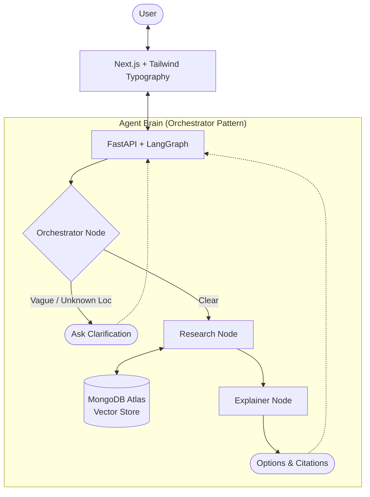

# Juris - The AI Legal Defender

> **"Access to Justice, Simplified."**

## 📖 Introduction
**Juris** is an Agentic Retrieval-Augmented Generation (RAG) system designed to level the playing field for tenants and low-income individuals facing legal challenges. It is **not** a lawyer. It is a highly sophisticated, autonomous research and drafting aide that empowers users to understand their rights and generate valid legal documents for review.

In 2026, the legal gap is widening. Juris bridges this gap by using state-of-the-art **Agentic AI** to turn complex legal jargon into actionable defense.

---

## 🏗️ Architecture: The "Agentic" Difference
Traditional RAG just retrieves text and summarizes it. **Juris** uses an **Agentic Workflow** that mirrors how a human paralegal works:

1.  **Orchestrator Node (The Brain)**: A single master agent that synthesizes the *entire* conversation history (not just the last output). It detects:
    *   **Jurisdiction**: Automatically distinguishes Ontario (N12) from BC (RTB-32).
    *   **Context**: Connects "Rent increase" (history) + "Ontario" (latest) into "Rent increase dispute in Ontario".
    *   **Clarity**: Decides whether to ask a follow-up question ("Which province?") or proceed.
2.  **Research Agent**: Autonomously searches our **MongoDB Atlas Vector Store**, intelligently filtering results by the detected jurisdiction (ON/BC/AB).
3.  **Explainer Node**: Instead of blindly drafting, it *explains* your options (e.g., "Dispute vs. Negotiate") and cites the law **verbatim** (Section 48/83).



---

## 🛠️ The 2026 Tech Stack (Winner's Configuration)

We have selected this stack based on **State-of-the-Art (SOTA) 2026 Benchmarks**:

| Component | Choice | Rationale |
| :--- | :--- | :--- |
| **Embeddings** | **Voyage AI (`voyage-law-2`)** | Benchmarks show it outperforms OpenAI/Gemini by ~10% on legal retrieval. It handles the nuance of "legalese" better than general models. |
| **LLM Reasoning** | **Google Gemini 2.0 Flash (Exp)** | The absolute fastest and most capable model available. Used for the Orchestrator's complex reasoning. |
| **Vector DB** | **MongoDB Atlas** | **Hybrid Search**: We need keyword search (for exact legal clause numbers) AND vector search (for concepts). Atlas does both natively. |
| **Orchestration** | **LangGraph** | Using the **Orchestrator-Worker** pattern. Allows for cyclical "Thinking Loops" and state persistence (Memory). |
| **Persistence** | **LangGraph Checkpointer** | The bot "remembers" context across turns (e.g. remembering you said "Ontario" 3 messages ago). |

---

## ⚖️ Ethics & Liability (Crucial)

**We are "Aiding", not "Replacing".**

To ensure we are ethical and safe, Juris enforces the following:

1.  **The "Red Box" Disclaimer**:
    > *WARNING: Juris is an AI research tool, not a law firm. This system produces drafts for informational purposes only. You must verify all citations with a qualified legal professional.*
2.  **Explainer Mode**: We prioritize *explaining options* over blind drafting, forcing the user to make the final strategic choice.
3.  **Citation Transparency**: Every sentence includes a verbatim citation (e.g., *"Section 48(1) states..."*).

---

## 🚀 Pros & Cons

### Pros
*   **Massive Cost Savings**: A paralegal costs $150/hr. Juris costs $0.05 per run.
*   **Smart Routing**: Automatically detects your province (ON/BC) and filters laws accordingly.
*   **Memory**: Conversational persistence (via `thread_id`) means it remembers your story.

### Cons
*   **Hallucination Risk**: AI can invent precedents. *Mitigation: Verbatim citation requirement.*
*   **Complexity bias**: Users might trust the "smart machine" too much. *Mitigation: Strongly worded UI warnings.*

---
### Troubleshooting
*   **Ingestion is Slow**: Voyage AI's free tier has a **3 RPM (Request Per Minute)** limit. The ingestion script sleeps for 25s between batches to respect this. This is normal.
*   **API Errors**: Ensure `VOYAGE_API_KEY` and `MONGODB_URI` are correct in `.env`.

## 🗺️ Roadmap

### Phase 1: The Core (Hackathon MVP)
- [ ] Ingest *Ontario Residential Tenancies Act* into MongoDB.
- [ ] Build the **Triage -> Research -> Draft** LangGraph loop.
- [ ] Create a simple Next.js frontend to upload a "Notice to Quit" and get a "Response Letter".

### Phase 2: The Network (Post-MVP)
- [ ] Add **Tailscale** for secure document sharing with a real pro-bono lawyer.
- [ ] Add **Voice Mode** (ElevenLabs) for accessibility.

---

## 💻 Getting Started

```bash
# Clone the monorepo
git clone https://github.com/your-team/juris.git

# Install dependencies
cd juris
npm install

# Set up secrets
cp .env.example .env
# (Add GEMINI_API_KEY, MONGODB_URI, VOYAGE_API_KEY)

# Run the Agent
cd agent
python agent_graph.py

# Run the UI
cd web
npm run dev
```
