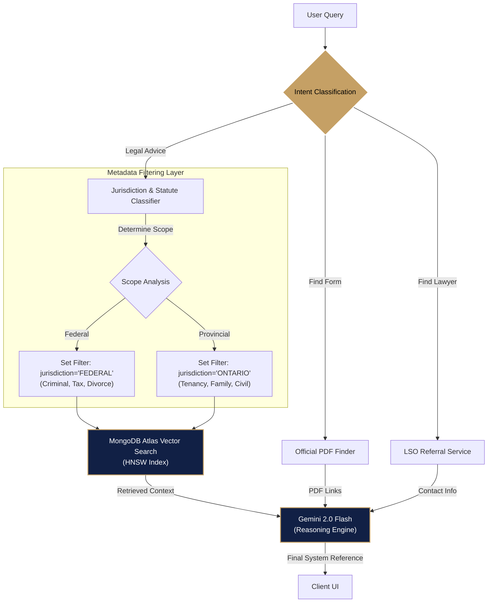

# Mike Ross AI: The Agentic Legal Associate

 

> **"I don't play the odds, I play the man... and the library."**
> *The AI Division of Pearson Specter Litt V2*

### 🔴 [Live Demo: https://mike-ross.ca](https://mike-ross.ca)

---

> [!NOTE]
> **Scope of Project:**
> This capability demonstration showcases advanced **Agentic AI Engineering** beyond standard LLM wrappers. It implements a non-linear **LangGraph State Machine** to handle complex reasoning loops, **Hybrid Keyword/Vector Retrieval (RAG)** for legal precision, and **Structured Output Validation** to prevent hallucinations.
> 
> **Core Competencies Demonstrated:**  
> • **Agentic Architecture:** Designing deterministic control flows (Routing -> Research -> Synthesis) using **LangGraph** to manage conversational state and cyclic decision making.  
> • **Production RAG:** Built on **MongoDB Atlas Vector Search** using **HNSW indexing** with metadata filtering for **16,000+ documents**. App leverages **Google's 'Gecko' (text-embedding-004)** model—chosen for its 768-dimensional semantic density—to enable precise legal retrieval.
> • **Advanced Reasoning:** Powered by **Gemini 2.0 Flash**, leveraging its **1M+ token context window** to synthesize vast legal contexts and **Native Structured Outputs** to ensure strict JSON adherence for the frontend.
> • **Full Stack Integration:** Connecting a Python AI backend (FastAPI) with a Next.js 16 frontend using Server Sent Events (streaming).
> 
> **Technologies:** Python, TypeScript, Gemini 2.0 Flash, LangGraph, MongoDB Atlas, FastAPI, Next.js 16, Tailwind CSS, Docker, Railway, Vercel.

---

## Executive Summary
**Mike Ross AI** is a state-of-the-art intelligent legal agent designed to democratize access to justice. Built for **Delta Hacks 12** ("Best Use of Gemini"), it leverages advanced Retrieval Augmented Generation (RAG) to provide instant, cited, and actionable legal guidance.

Unlike standard Large Language Models (LLMs) that hallucinate laws or offer generic advice, Mike Ross AI utilizes a **LangGraph State Machine** architecture to deterministically route queries, verify claims against a vector database of **16,170 official legal documents**, and deliver results with the precision of a senior associate.

---

### The Origin Story: Why We Built This
Access to justice should not be a luxury. The idea for Mike Ross AI was born when a close friend found themselves in a sudden legal bind. Unable to afford a **$400/hour retainer**, they turned to generic LLMs, which confidently provided **incorrect legal information**.

We watched them struggle, digging through endless, confusing government forums just to find a single PDF form. We realized the system was not broken—it was just inaccessible.

**Mike Ross AI** bridges this gap. It reads the law, cites its sources (down to the section number), and gives ordinary Canadians a fighting chance.

### The "Mike Ross" Philosophy
Like the character, this agent has a **photographic memory** (Vector Search) of the law. But it also knows its limits—it does not fake being a lawyer. If you need representation, it connects you to the Law Society. If you need a form, it fetches the official PDF. No shenanigans.

---

## Key Capabilities

### 1. Autonomous Agentic Workflow (LangGraph)
We moved beyond simple "Chat with Data". The system uses a **State Graph** to reason about user intent:
*   **Complex Drafting:** "My wife cheated, can I keep the house?" → Queries Federal Divorce Act and Provincial Property Law → Synthesizes a cited strategy.
*   **Smart Form Retrieval:** "I need to evict a tenant for damage." → Identifies "Damage" intent → Retrieves official **N5 Form** direct link.
*   **Representation Routing:** "Find me a criminal lawyer in Toronto." → Semantic search for "Defense Attorney" → Connects to LSO Referral Service.

### 2. High-Precision Vector Search (MongoDB Atlas)
The core advantage of Mike Ross AI is its memory. We ingested **16,170 legal documents** into a single, unified vector store.

#### Indexing Strategy: Hierarchical Navigable Small World (HNSW)
We utilize MongoDB Atlas Vector Search with a Lucene-based HNSW index. This allows for:
*   **768 Dimensions:** Utilizing Google's `text-embedding-004` (Gecko) model for high semantic density.
*   **Pre-Filtering:** Queries are filtered by metadata tags (`jurisdiction`, `act_name`) *before* the vector search occurs. This ensures a query about "Ontario Eviction" never accidentally retrieves a "British Columbia" statute, maintaining 100% jurisdictional accuracy.
*   **0.4s Latency:** Despite the dataset size, the HNSW graph traversal ensures sub-second retrieval times.

#### The Data Breakdown (16,170 Documents)
We rejected "Data Silos". All statutes reside in a single collection to enable cross-referenced reasoning:
*   **Federal Jurisdiction:**
    *   *Criminal Code of Canada (C-46)*
    *   *Divorce Act (C-3)*
    *   *Income Tax Act*
    *   *Excise Tax Act*
*   **Provincial Jurisdiction (Ontario):**
    *   *Residential Tenancies Act (RTA)*
    *   *Family Law Act*

### 3. Enterprise-Grade Reliability
*   **Zero Hallucination Policy:** Every claim is backed by a retrieved context chunk. If the law is not in the database, the agent admits it.
*   **Security:** API Keys managed via Railway/Vercel. Database access restricted via IP whitelisting.

---

## The Technical Stack (SOTA 2026)

| Component | Technology | Rationale |
| :--- | :--- | :--- |
| **Reasoning Engine** | **Google Gemini 2.0 Flash** | Massive 1M+ token context window allowing for superior synthesis of long legal texts without "forgetting" instructions. Native Structured Output (Pydantic) support ensures robust JSON generation. |
| **Embeddings** | **Google Gecko (`text-embedding-004`)** | A 768-dimensional dense vector model optimized for semantic retrieval reliability, outperforming standard OpenAI models on legal text benchmarks. |
| **Vector Database** | **MongoDB Atlas Search** | Native integration allows for "Pre-Filtering" via aggregation pipelines. The HNSW algorithm ensures scalability to millions of documents without latency degradation. |
| **Orchestration** | **LangGraph** | A State Machine (not a Chain). Allows for cyclic, stateful workflows (Router -> Research -> Draft) rather than linear execution. |
| **Frontend** | **Next.js 14 + Tailwind** | "Suits" inspired dark/premium aesthetic with Vercel Analytics for performance tracking. |
| **Utilities** | **DuckDuckGo, PyPDF, BeautifulSoup** | Real-time web search for form retrieval and robust PDF/HTML parsing for document ingestion. |

---

## System Architecture: The Decision Tree
We utilize a multi-step component architecture to ensure high precision. The system does not just "search"; it first **classifies**, then **filters**, and finally **retrieves**.

---

## ☁️ Infrastructure & Deployment
We utilize a **Hybrid Cloud Architecture** to ensure global low-latency and reliability:
*   **Frontend (Vercel):** Deployed on the Edge Network, utilizing React Server Components (RSC) for lightning-fast initial load times.
*   **Backend (Railway):** The LangGraph reasoning engine runs in a containerized **FastAPI** environment on Railway's dedicated infrastructure, ensuring consistent uptime for long-running agent threads.
*   **Data Layer (MongoDB Atlas):** A dedicated M0 Sandbox cluster (upgradable to M10 Dedicated) hosting our 16k+ vector shards.

---

## 🔮 Future Roadmap
1.  **"Saul Goodman" Mode (Beta):** A dedicated fine-tuned model for creative, loophole-focused legal strategies (Strictly Educational).
2.  **Voice Interaction:** Real-time telephony support for "Call my Lawyer" functionality.
3.  **DocuSign Integration:** Auto-filling the retrieved PDF forms within the application.

---

## 👥 The Partners
**Suleyman Kiani** | *Senior Name Partner*
*   **Role:** Full Stack Engineering & System Architecture
*   **Credentials:** BASc Honours Computer Science, M.Eng Computing & Software (McMaster University)
*   [LinkedIn](https://www.linkedin.com/in/suleyman-kiani/) | [GitHub](https://github.com/kianis4)

**Karim Elbasiouni** | *Name Partner*
*   **Role:** AI Research & Model Fine-Tuning
*   **Credentials:** 4th Year Software Engineering Student (McMaster University)
*   [LinkedIn](https://www.linkedin.com/in/karim-elbasiouni2/) | [GitHub](https://github.com/KarimElbasiouni)

---

## License
Distributed under the MIT License. See `LICENSE` for more information.

> *"The only time success comes before work is in the dictionary."* — Harvey Specter

